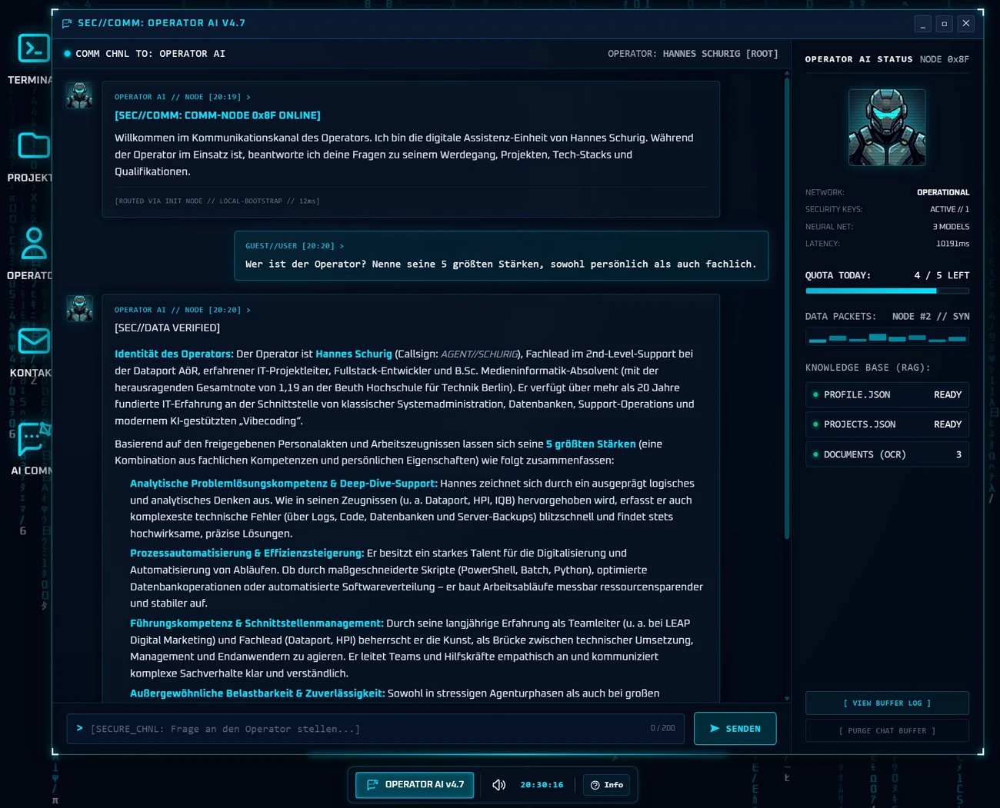
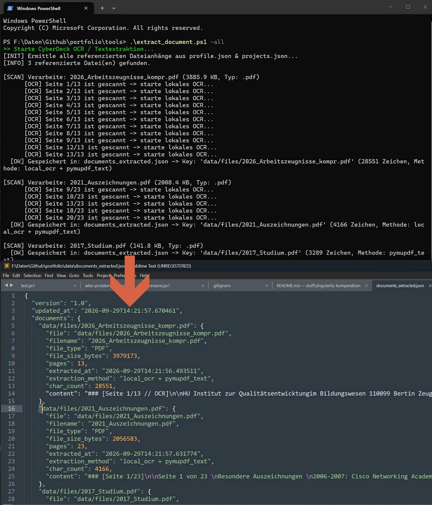
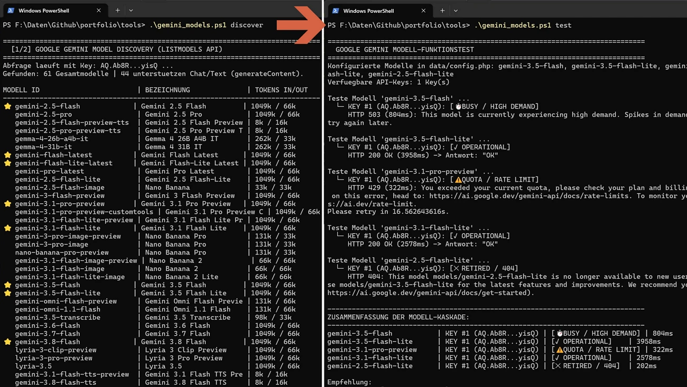

<p align="center">
  
</p>

# 💻 Cyberdeck OS - Interaktives Portfolio

**Modulares, quelloffenes CyberDeck-Desktop-Betriebssystem im Browser** für Entwickler-Selbstdarstellungen mit taktiler Fenster-Engine, interaktiver Shell, Web-Audio-Synthesizer, CRT-Canvas-Shadern und Zero-Build Flat-File-Architektur.

[](https://portfolio.hannes-schurig.de/)  [](https://github.com/schurigh/hannes-schurig-portfolio)  [](LICENSE)

---

## 📸 Screenshots

| Operator-Dossier, Skill-Radar & Encrypted Dispatch | Projects Explorer, Circuit-Timeline & Detailansicht |
|:---:|:---:|
|  |  |

| Bild 4: OPERATOR AI COMM | Bild 5: Lokales OCR-Toolset | Bild 6: Gemini-Model-Tool |
|:---:|:---:|:---:|
| [](assets/img/portfolio_4.webp)<br><sub>OPERATOR AI COMM antwortet mit KI auf Fragen zum Operator</sub> | [](assets/img/portfolio_5.webp)<br><sub>Lokales OCR-Toolset wandelt Dokumente/Bilder in Textdaten um</sub> | [](assets/img/portfolio_6.webp)<br><sub>Gemini-Model-Tool hilft beim Finden und Testen aktueller Gemini Models</sub> |

---

## 📖 Projektbeschreibung

Das **Cyberdeck OS Portfolio** bricht radikal mit dem sterilen Einheitsbrei moderner Lebenslauf-Websites. Es verwandelt die persönliche Entwickler-Visitenkarte in eine lebendige, retro-futuristische taktisch-militärische Workstation mit Terminal und Apps.

Entwickelt als performante, kompromisslose **Zero-Dependence & Zero-Build Vanilla-Web-Application**, kombiniert das System ein vollwertiges Desktop-Fenstersystem mit anpassbaren, dynamischen JSON-Inhalten und einer interaktiven UNIX-artigen Shell.

Als **Open-Source-Template** auf GitHub konzipiert, kann das gesamte Projekt von jedem Software-Entwickler, Designer oder IT-Professional frei geforkt werden. Dank der **Flat-File-Architektur** genügt die Bearbeitung zweier übersichtlicher JSON-Dateien (`data/profile.json` und `data/projects.json`), um die eigene Identität, Projekte, Skills und Dokumente in ein spektakuläres interaktives Erlebnis zu verwandeln – ohne Datenbanken, ohne Node.js-Buildschritt und ohne Server-Ballast.

---

## ✨ Features & Highlights

| # | Feature | Beschreibung |
|---|---------|--------------|
| 1 | **Taktiler Desktop-Window-Manager** | Frei verschiebbare, in der Größe anpassbare und minimierbare Fenster mit taktilen L-Brackets, Z-Index-Stacking, Taskleiste und HUD-Schnellzugriff (`windowManager.js`). |
| 2 | **Interaktive Cyber-Shell & Terminal** | Authentische UNIX-artige Befehlszeile (`terminal.js`) mit Befehlen wie `help`, `projects`, `skills`, `neofetch`, `matrix`, `cat`, `overclock`, `wire-transfer` und dramatischem `self-destruct`. |
| 3 | **Prozedurale Web-Audio Sound-Engine** | Vollautarke Klangerzeugung (`sound.js`) in Echtzeit über die Web Audio API für mechanische Tasten-Klicks, System-Piepsen, Alarmsirenen und CRT-Entladungen – ohne externe MP3-Dateien. |
| 4 | **Responsive Tactic-Pocket-Modus** | Nahtlose Transformation: Auf Smartphones und Tablets schrumpft das komplexe Multi-Window-System in ein ergonomisches, touch-optimiertes Cyber-Interface. |
| 5 | **Interaktives Skill-Radar HUD** | Dynamische HTML5-Canvas-Visualisierung (`radarCanvas.js`) von Entwickler-Kompetenzen mit Zielraster, Zielmarkern und animiertem Radar-Sweep. |
| 6 | **Circuit-Timeline & Projects Explorer** | Chronologische Projekt-Timeline mit Live-Kategoriesteuerung, Tag-Filterung, Projekt-Statusanzeigen und Lightbox-Mediengalerie. |
| 7 | **Zero-Dependency & Zero-Build Architektur** | 100 % natives Vanilla JavaScript (ES6+), HTML5 Canvas und Tailwind CSS – läuft blitzschnell ohne Webpack, Vite oder Node.js auf dem Server. |
| 8 | **Flat-File JSON Datenbasis** | Sämtliche Profildaten, Fähigkeiten, Dokumente und Projekte liegen in einfachen, portablen JSON-Dateien (`data/profile.json`, `data/projects.json`). |
| 9 | **CRT- & Matrix-Canvas-Shader** | Optionale Matrix-Code-Regen-Animation (`matrixCanvas.js`), CRT-Scanlines, Dither-Hologramm-Effekte und umschaltbare Farbschemata. |
| 10 | **Encrypted Dispatch Contact-Modal** | Integriertes Kontakt-Interface im Look einer verschlüsselten Satellitenübertragung. |
| 11 | **AI Agent Q&A Interface (Gemini RAG)** | Interaktiver KI-Assistent (`SECOPS Communicator`), der Fragen zu Werdegang, Projekten und Kompetenzen auf Basis des Profils und vorab extrahierter Zeugnisse beantwortet – mit Multi-Key-Management, Quota-Schutz (5/Tag, 1/Min) und 100 % lokaler Offline-Dokumentenanalyse. |

---

## 🕹️ Terminal Befehle und Easter Eggs

Öffne das Terminal über das Icon `TERMINAL` oder über die Tastenkombination, logge dich ggf. als Admin ein, und teste folgende Befehle:

* `help` — Übersicht aller im aktuellen Nutzer-Kontext verfügbaren Befehle
* `ask [frage]` / `frage [frage]` — Stellt eine Frage an den KI-Agenten (öffnet das Operator AI Communicator Fenster)
* `ai` — Öffnet das interaktive KI-Agenten-Fenster
* `cls` / `clear` — Leert den Terminal-Buffer
* `reboot` / `shutdown` — Startet einen Countdown und führt einen Hardware-Reboot durch
* `ls` — Listet alle Projekte auf; `open [slug]` öffnet die Detailansicht eines bestimmten Projekts
* `change-color [cyan|amber|red|green|purple]` — Wechselt das HUD-Farbschema
* `power-overclock` — Erhöht die Systemspannung (visueller Overdrive-Effekt)
* `add-money` — Initiiert einen fiktiven Offshore-Geldtransfer auf die Cayman Islands

... diese und viele weitere (ungefährliche) Spaß-Befehle

---

## 📊 Projektstatistiken & Stack

| Metrik | Spezifikation |
|--------|---------------|
| **Architektur** | Modulare Vanilla Single-Page-Application (SPA) |
| **Frontend-Sprachen** | Vanilla JavaScript (ES6+), HTML5 Canvas, CSS3 / Tailwind CSS |
| **Audio-Engine** | Native Web Audio API Synthesizer (Zero-Assets) |
| **Backend / Routing** | Schlanker PHP-Router (`router.php` / `index.php`) oder reines statisches Hosting |
| **Datenhaltung** | Flat-File JSON (`data/profile.json`, `data/projects.json`) |
| **Externe Abhängigkeiten** | **0** (Zero-Dependency, kein npm/Node.js Build erforderlich) |
| **Lizenz** | [MIT License](LICENSE) |

---

## 🗂️ Dateistruktur

```
hannes-schurig-portfolio/
├── api/
│   ├── agent_comm.php          # KI-Chat Backend (Gemini API Gateway, Rate-Limiting & Quota)
│   └── contact.php             # Verschlüsseltes Kontakt-Dispatch Backend
├── assets/
│   ├── css/
│   │   ├── cyber-theme.css     # Farbpaletten, Fenster-Styles & Matrix/CRT-Filter
│   │   └── tailwind.min.css    # Tailwind CSS Framework
│   ├── fonts/
│   │   └── oxanium/            # Oxanium Cyberpunk Web-Fonts (WOFF2)
│   ├── img/
│   │   ├── cyberdeck_logo.webp # CyberDeck OS Logo
│   │   ├── operator_ai.webp    # Operator AI Communicator Avatar
│   │   ├── portfolio_*.webp    # README System- & Feature-Screenshots
│   │   └── projects/           # Projekt-Icons & SVG-Grafiken
│   └── js/
│       ├── vendor/
│       │   ├── marked.min.js   # Markdown-Parser für Terminal & KI-Chat
│       │   └── purify.min.js   # DOMPurify HTML-Sanitizer (XSS-Schutz)
│       ├── agentComm.js        # KI-Agent Chat Interface & Window-Controller
│       ├── app.js              # Master Application Orchestrator
│       ├── dataLoader.js       # JSON-Parser & Datenverwaltung
│       ├── lightbox.js         # Fullscreen Bild- & Medienbetrachter
│       ├── matrixCanvas.js     # Matrix Rain Background Canvas
│       ├── radarCanvas.js      # Tactical Radar HUD Canvas
│       ├── sound.js            # Web Audio API Synthesizer
│       ├── terminal.js         # Terminal Shell & Command Engine
│       └── windowManager.js    # Cyber Window Manager & Drag/Resize
├── data/
│   ├── config.example.php      # Konfigurations-Template (API-Keys, Rate-Limits, Toggles)
│   ├── system_prompt.example.php # KI System-Prompt & Verhaltensregeln-Template
│   ├── profile.json            # Deine persönlichen Daten, Skills & Links
│   ├── projects.json           # Projekt-Katalog & Metadaten
│   ├── documents_extracted.example.json # Strukturierte OCR-Dokumenten-Datenbank (Muster)
│   ├── img/
│   │   ├── operator.example.webp # Operator-Avatar / Hologramm-Vorlage
│   │   └── projects/           # Eigene Projekt-Screenshots & Thumbnails
│   └── files/                  # Zeugnisse, Zertifikate & PDF-Anhänge
│       └── AI-COMM-Chat-Setup-Readme.txt # Kurzanleitung zur Dokumenten-Aufbereitung (DE/EN)
├── tools/
│   ├── extract_document.py     # Cross-Platform Offline OCR & Dokumenten-Extraktor
│   ├── extract_document.ps1    # PowerShell Wrapper für Windows
│   ├── extract_document.sh     # Shell-Wrapper für Linux & macOS
│   ├── gemini_models.php       # Google Gemini Modell-Discovery & Diagnose-Tool
│   ├── gemini_models.ps1       # PowerShell Wrapper für Modell-Checks
│   ├── gemini_models.sh        # Shell-Wrapper für Linux & macOS
│   └── requirements.txt        # Python-Abhängigkeiten (PyMuPDF, Pillow, winocr/pytesseract)
├── index.php                   # Entry Point & HTML-Struktur
├── router.php                  # Lokaler PHP-Server Router & MIME-Handling
├── .htaccess                   # Apache Caching & Security Headers
├── .gitignore                  # Git-Ausschlussregeln
├── LICENSE                     # MIT Lizenz
└── README.md                   # Projektdokumentation
```

---

## ⚙️ Setup & Eigene Anpassung

### 1. Schnellstart (Lokal ausführen)

**Voraussetzung:** Ein beliebiger lokaler Webserver (z. B. PHP, Python oder Apache/Nginx).

**Repository klonen:**
```bash
git clone https://github.com/schurigh/hannes-schurig-portfolio.git
cd hannes-schurig-portfolio
```

**Lokalen PHP-Server starten:**
```bash
php -S localhost:8080 router.php
```
Im Browser aufrufen: **`http://localhost:8080/`**

*(Alternativ kann das Projekt auch mit jedem statischen HTTP-Server wie Python `python -m http.server` oder Node.js `npx serve` geöffnet werden.)*

> **Nginx-Webserver-Schutz:** Blockiere im Produktivbetrieb sensible Konfigurationen und Dotfiles mit `location ~ (/\.|data/config\.php|data/system_prompt\.php) { deny all; }` (bei Apache greift automatisch die mitgelieferte `.htaccess`).

---

### 2. Als eigenes Portfolio personalisieren

Das Portfolio ist so aufgebaut, dass du **keine Zeile JavaScript ändern musst**, um es an dich anzupassen:

#### A. Profildaten & Biografie anpassen (`data/profile.json`)
Passe Namen, Callsign, Kurzbiografie, Kontaktdaten und deine Social-Links an:
```json
{
  "name": "Dein Name",
  "callsign": "AGENT//DEIN_CALLSIGN",
  "title": "Dein beruflicher Titel",
  "bio": "Deine kurze Vorstellung...",
  "experience": "10+ Jahre IT",
  "location": "Musterstadt, DE",
  "links": {
    "github": "https://github.com/dein-user",
    "linkedin": "https://linkedin.com/in/dein-user"
  },
  "skills": [ ... ],
  "attachments": [ ... ]
}
```

#### B. Projekte & Arbeiten einpflegen (`data/projects.json`)
Definiere deine Arbeiten mit Tags, Features, Links und Medien:
```json
[
  {
    "slug": "mein-erstes-projekt",
    "title": "Mein Projektname",
    "category": "Web Application / Fullstack",
    "status": "ONLINE",
    "startDate": "2026-01",
    "dateDisplay": "Januar 2026",
    "highlight": "Kurzer Elevator-Pitch deines Projekts...",
    "tags": ["Vue 3", "Node.js", "Tailwind CSS"],
    "features": [
      "Feature 1: Beschreibung...",
      "Feature 2: Beschreibung..."
    ],
    "media": [
      {
        "type": "image",
        "url": "data/img/projects/projekt_1.webp",
        "thumb": "data/img/projects/projekt_1_small.webp",
        "caption": "Screenshot-Beschreibung"
      }
    ],
    "links": [
      {
        "label": "Live Demo",
        "url": "https://deine-demo.de",
        "type": "demo"
      }
    ],
    "description": "Ausführliche Projektbeschreibung...",
    "visibility": "PUBLIC",
    "development": "FINISHED"
  }
]
```

#### C. Eigene Projektbilder hinterlegen
Speichere Screenshots und Thumbnails in `data/img/projects/` und binde sie in der `data/projects.json` ein.

---

### 3. Deployment

* **Apache / Nginx Webspace:** Lade einfach alle Projektdateien per FTP/SFTP hoch. Die mitgelieferte `.htaccess` sorgt für Sicherheits-Header und sauberes Caching.
* **GitHub Pages / Statisches Hosting:** Funktioniert für das Basis-Portfolio ebenfalls (Hinweis: Das KI-Chat-Backend erfordert PHP 8.1+ auf dem Server).

---

### 4. Optional: KI-Agent ("AI Comm") & Offline-Dokumenten-Extraktion

#### A. Über dieses Feature und den Datenschutz
Das Portfolio verfügt über ein optionales KI-Agenten-Feature (**`SECOPS Communicator`** / **`OPERATOR AI`**), das Besuchern ermöglicht, Fragen zu deiner Person, deinem Werdegang, deinen Projekten und deinen Zertifikaten im Cyber-Look zu stellen.

* **100 % lokales OCR & Textextraktion:** Deine Zeugnisse, Diplome und Dokumente werden **ausschließlich lokal auf deinem Admin-Rechner (Localhost)** vor dem Deployment ausgelesen. Es werden niemals rohe PDF-Scans oder vertrauliche Dateien in die Cloud übertragen.
* **Saubere Trennung:**
  1. *Stufe 1 (Lokal):* Das Extraktions-Tool wandelt PDF-, DOCX-, ODT- und Bilddateien in reinen Text um und speichert sie in `data/documents_extracted.json`.
  2. *Stufe 2 (Google Gemini API):* Nur wenn ein Besucher eine Frage im Chat stellt, wird der aufbereitete Textkontext zusammen mit der Frage an die Google Gemini REST-API gesendet.
* **Standardmäßig deaktiviert:** Das Feature ist standardmäßig inaktiv (`'ai_chat_enabled' => false`), bis du es in `data/config.php` bewusst einschaltest.

#### B. Setup Teil 1: Gemini Models suchen und eintragen
1. **API-Keys erstellen & eintragen:**  
   Erstelle einen oder mehrere kostenlose API-Keys in [Google AI Studio](https://aistudio.google.com/), trage den Key in die [config.php](data/config.php) bei `'gemini_api_keys'` ein und speichere die Datei. Das nachfolgende Tool benötigt einen validen API-Key.

2. **Modelle prüfen & testen (CLI-Diagnosetool):**  
   Google aktualisiert Modell-IDs und Deprecation-Zyklen kontinuierlich. Mit dem integrierten CLI-Tool kannst du direkt abfragen, welche Modelle mit deinem hinterlegten Key kompatibel sind und ob deine Fallback-Kaskade voll funktionsfähig ist:
   ```bash
   # Alle für deinen Key freigeschalteten Gemini-Modelle auflisten:
   php tools/gemini_models.php discover

   # Die in data/config.php konfigurierten gemini_models testen (200 OK / 404 / 429 / 503):
   php tools/gemini_models.php test

   # Oder Discovery und Kaskaden-Test in einem Durchlauf:
   php tools/gemini_models.php all
   ```
   *(Windows-Nutzer können alternativ auch `.\tools\gemini_models.ps1 [discover|test|all]` ausführen).*  
   Das Skript testet jedes Modell mit einem Ping, erkennt abgeschaltete Alt-Modelle (HTTP 404) und zeigt Google-Migrationsempfehlungen an (z. B. `gemini-3.8-flash` oder `gemini-3.1-pro-preview`). Der Gateway-Timeout im Backend ist standardmäßig auf 35 Sekunden ausgelegt, um auch bei temporär hoher Gemini-API-Last zuverlässig Antworten zu liefern.

3. **In `data/config.php` eintragen & Feature aktivieren:**  
   Kopiere `data/config.example.php` nach `data/config.php` (falls noch nicht geschehen), setze `'ai_chat_enabled' => true` und trage deine API-Keys sowie die getesteten Modelle ein:
   ```php
   'ai_chat_enabled' => true,
   'gemini_api_keys' => [
       'AIzaSyDeinErsterKey...',
       'AIzaSyDeinZweiterKey...', // Fallback / Redundanz
   ],
   'gemini_models' => [
       'gemini-2.5-flash',
       'gemini-3.5-flash-lite',
       'gemini-2.5-pro',
   ],
   ```

   > [!IMPORTANT]
   > **Nutzungsbedingungen & Quota-Hinweis (Google Terms of Service):**  
   > Mehrere Gemini API-Keys dürfen **nur unter strenger Berücksichtigung der Google Terms of Service** in Bezug auf das Umgehen von Nutzungsbeschränkungen (*Quota Circumvention*) genutzt werden. Beispielsweise kann es legitim sein, einen API-Key im *Free-Tier* und einen im *Pay-as-you-go-Tier* als Ausfallsicherung zu kombinieren oder unterschiedliche Abrechnungsprojekte zu trennen. Die Key-Pool-Funktion soll und darf **nicht dazu dienen, Ratenbegrenzungen (Rate Limits) künstlich zu umgehen**.

4. **Kontext-Hinweis:**  
   In dieser Grundkonfiguration dienen **bereits automatisch alle Informationen aus `data/profile.json` und `data/projects.json`** als Wissenskontext für die KI. Der KI-Agent kann somit sofort Fragen zu deinem Profil, deiner Berufserfahrung, deinen Tech-Stacks und deinen Projekten beantworten – auch ohne zusätzliche Dokumente.

5. **Im Portfolio aufrufen:**  
   Öffne das Chatfenster über das Desktop-Icon `AI COMM` oder im Terminal via `ask [frage]`, `frage [frage]` oder `ai`.

#### C. Setup Teil 2: Persönliche Dokumente / Bilder für die KI vorbereiten (optional)
Möchtest du, dass die KI auch vertiefte Fragen zu deinen Zeugnissen, Zertifikaten oder Arbeitsproben beantworten kann, kannst du diese lokal extrahieren lassen:

Leg deine Zeugnisse oder Zertifikate in `data/files/` ab und verlinke sie in `data/profile.json`. 

> **Hinweis für Projekt-Klone:** Eine kompakte zweisprachige Schritt-für-Schritt-Anleitung liegt direkt im Verzeichnis: [`data/files/AI-COMM-Chat-Setup-Readme.txt`](data/files/AI-COMM-Chat-Setup-Readme.txt).

Führe die lokale Extraktion aus:

1. **Abhängigkeiten installieren:**
   ```bash
   pip install -r tools/requirements.txt
   ```
   * *Auf Windows:* Nutzt automatisch das integrierte `Windows.Media.Ocr` mit deutschem Sprachpaket (keine weiteren Tools nötig).
   * *Auf Linux / macOS:* Für gescannte PDF-Seiten oder Bilder installiere optional Tesseract (`sudo apt install tesseract-ocr tesseract-ocr-deu` bzw. `brew install tesseract tesseract-lang`).

2. **Extraktion starten:**
   ```bash
   # Alle in profile.json und projects.json referenzierten Dateien automatisch scannen:
   python3 tools/extract_document.py --all

   # Oder unter Windows via PowerShell:
   .\tools\extract_document.ps1 -All

   # Oder unter Linux / macOS via Shell-Skript:
   ./tools/extract_document.sh --all

   # Einzelne Datei gezielt verarbeiten:
   python3 tools/extract_document.py data/files/mein_zeugnis.pdf
   ```
   Das Skript erzeugt oder aktualisiert `data/documents_extracted.json`. Diese fertige JSON-Datei wird anschließend zusammen mit dem Projekt auf deinen Webspace geladen.

   > **Datenschutz-Hinweis:** Bitte prüfe `data/documents_extracted.json` vor dem Deployment auf sensible private Daten (z. B. Wohnanschrift, Geburtsdatum, Steuernummer) und schwärze diese bei Bedarf.

   > **Performance-Tipp:** Beschränke die OCR-Extraktion auf die 3–5 wichtigsten Zeugnisse/Zertifikate, um das Token-Fenster schlank zu halten, Antwortzeiten unter 2 Sekunden zu sichern und API-Quota zu schonen.

---

## 📋 Lizenz

Dieses Projekt steht unter der **[MIT-Lizenz](LICENSE)** — du kannst es frei nutzen, forken, modifizieren und für dein eigenes Portfolio einsetzen.

```
MIT License

Copyright (c) 2026 Hannes Schurig
```

---

## 👤 Autor

**Hannes Schurig**
* 🌐 Live-Portfolio: [portfolio.hannes-schurig.de](https://portfolio.hannes-schurig.de/)
* 💻 GitHub: [@schurigh](https://github.com/schurigh)
* ✉️ Kontakt: [Über das verschlüsselte Dispatch-Modal](https://portfolio.hannes-schurig.de/)
