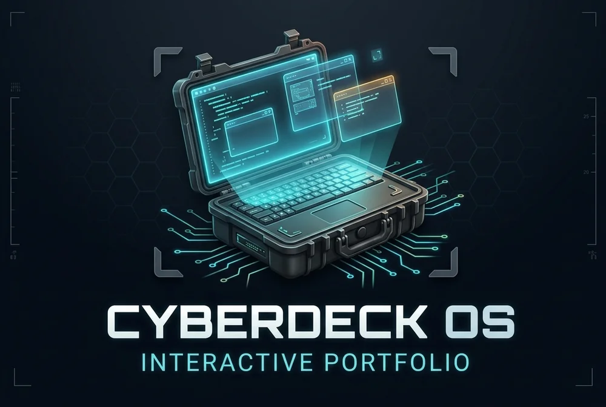
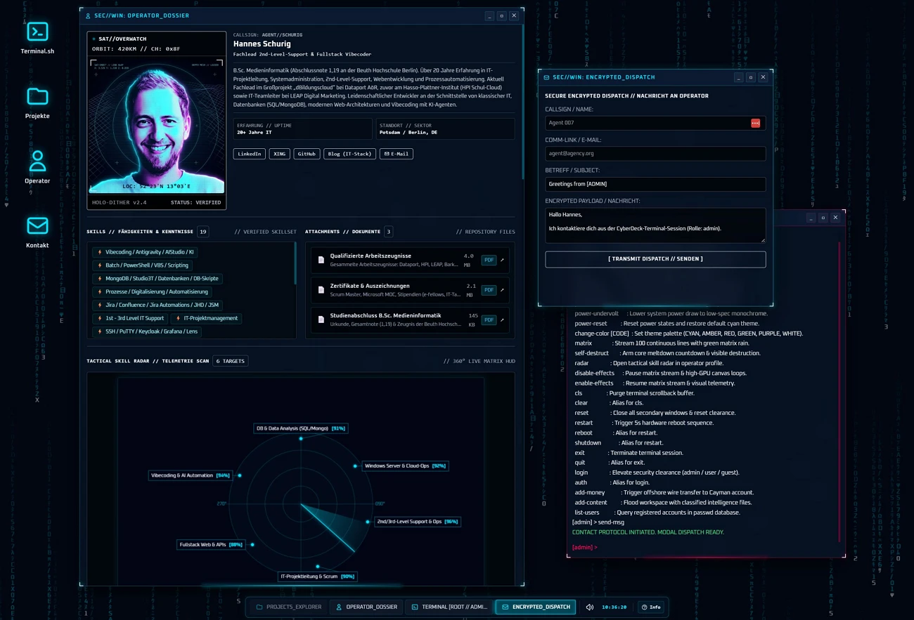
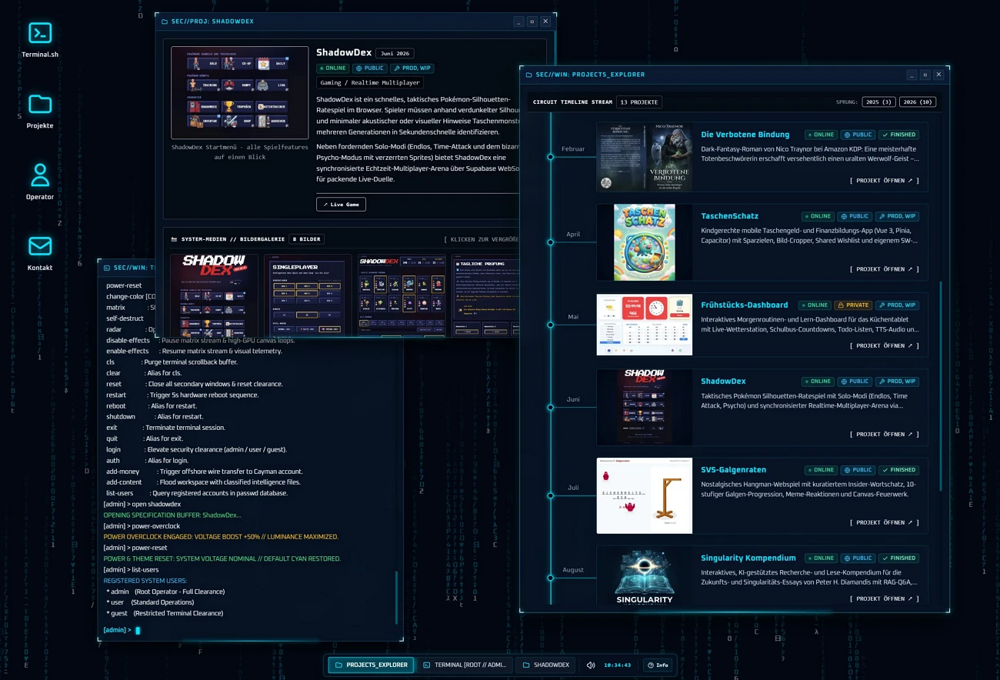

<p align="center">
  
</p>

# 💻 Cyberdeck OS - Interaktives Portfolio

**Modulares, quelloffenes CyberDeck-Desktop-Betriebssystem im Browser** für Entwickler-Selbstdarstellungen mit taktiler Fenster-Engine, interaktiver Shell, Web-Audio-Synthesizer, CRT-Canvas-Shadern und Zero-Build Flat-File-Architektur.

[](https://portfolio.hannes-schurig.de/)  [](https://github.com/schurigh/hannes-schurig-portfolio)  [](LICENSE)

---

## 📸 Screenshots

| Operator-Dossier, Skill-Radar & Encrypted Dispatch | Projects Explorer, Circuit-Timeline & Detailansicht |
|:---:|:---:|
|  |  |

---

## 📖 Projektbeschreibung

Das **Cyberdeck OS Portfolio** bricht radikal mit dem sterilen Einheitsbrei moderner Lebenslauf-Websites. Es verwandelt die persönliche Entwickler-Visitenkarte in eine lebendige, retro-futuristische taktisch-militärische Workstation mit Terminal und Apps.

Entwickelt als performante, kompromisslose **Zero-Dependence & Zero-Build Vanilla-Web-Application**, kombiniert das System ein vollwertiges Desktop-Fenstersystem mit anpassbaren, dynamischen JSON-Inhalten und einer interaktiven UNIX-artigen Shell.

Als **Open-Source-Template** auf GitHub konzipiert, kann das gesamte Projekt von jedem Software-Entwickler, Designer oder IT-Professional frei geforkt werden. Dank der **Flat-File-Architektur** genügt die Bearbeitung zweier übersichtlicher JSON-Dateien (`data/profile.json` und `data/projects.json`), um die eigene Identität, Projekte, Skills und Dokumente in ein spektakuläres interaktives Erlebnis zu verwandeln – ohne Datenbanken, ohne Node.js-Buildschritt und ohne Server-Ballast.

---

## ✨ Features & Highlights

| # | Feature | Beschreibung |
|---|---------|--------------|
| 1 | **Taktiler Desktop-Window-Manager** | Frei verschiebbare, in der Größe anpassbare und minimierbare Fenster mit taktilen L-Brackets, Z-Index-Stacking, Taskleiste und HUD-Schnellzugriff (`windowManager.js`). |
| 2 | **Interaktive Cyber-Shell & Terminal** | Authentische UNIX-artige Befehlszeile (`terminal.js`) mit Befehlen wie `help`, `projects`, `skills`, `neofetch`, `matrix`, `cat`, `overclock`, `wire-transfer` und dramatischem `self-destruct`. |
| 3 | **Prozedurale Web-Audio Sound-Engine** | Vollautarke Klangerzeugung (`sound.js`) in Echtzeit über die Web Audio API für mechanische Tasten-Klicks, System-Piepsen, Alarmsirenen und CRT-Entladungen – ohne externe MP3-Dateien. |
| 4 | **Responsive Tactic-Pocket-Modus** | Nahtlose Transformation: Auf Smartphones und Tablets schrumpft das komplexe Multi-Window-System in ein ergonomisches, touch-optimiertes Cyber-Interface. |
| 5 | **Interaktives Skill-Radar HUD** | Dynamische HTML5-Canvas-Visualisierung (`radarCanvas.js`) von Entwickler-Kompetenzen mit Zielraster, Zielmarkern und animiertem Radar-Sweep. |
| 6 | **Circuit-Timeline & Projects Explorer** | Chronologische Projekt-Timeline mit Live-Kategoriesteuerung, Tag-Filterung, Projekt-Statusanzeigen und Lightbox-Mediengalerie. |
| 7 | **Zero-Dependency & Zero-Build Architektur** | 100 % natives Vanilla JavaScript (ES6+), HTML5 Canvas und Tailwind CSS – läuft blitzschnell ohne Webpack, Vite oder Node.js auf dem Server. |
| 8 | **Flat-File JSON Datenbasis** | Sämtliche Profildaten, Fähigkeiten, Dokumente und Projekte liegen in einfachen, portablen JSON-Dateien (`data/profile.json`, `data/projects.json`). |
| 9 | **CRT- & Matrix-Canvas-Shader** | Optionale Matrix-Code-Regen-Animation (`matrixCanvas.js`), CRT-Scanlines, Dither-Hologramm-Effekte und umschaltbare Farbschemata. |
| 10 | **Encrypted Dispatch Contact-Modal** | Integriertes Kontakt-Interface im Look einer verschlüsselten Satellitenübertragung. |

---

## 📊 Projektstatistiken & Stack

| Metrik | Spezifikation |
|--------|---------------|
| **Architektur** | Modulare Vanilla Single-Page-Application (SPA) |
| **Frontend-Sprachen** | Vanilla JavaScript (ES6+), HTML5 Canvas, CSS3 / Tailwind CSS |
| **Audio-Engine** | Native Web Audio API Synthesizer (Zero-Assets) |
| **Backend / Routing** | Schlanker PHP-Router (`router.php` / `index.php`) oder reines statisches Hosting |
| **Datenhaltung** | Flat-File JSON (`data/profile.json`, `data/projects.json`) |
| **Externe Abhängigkeiten** | **0** (Zero-Dependency, kein npm/Node.js Build erforderlich) |
| **Lizenz** | [MIT License](LICENSE) |

---

## 🗂️ Dateistruktur

```
hannes-schurig-portfolio/
├── assets/
│   ├── css/
│   │   ├── custom.css          # Cyber-Spezifische Overrides & HUD-Styles
│   │   └── cyber-theme.css     # Farbpaletten & Matrix/CRT-Filter
│   ├── fonts/                  # Oxanium & Cyberpunk Web-Fonts
│   ├── img/                    # UI-Assets, Logo & README-Screenshots
│   │   ├── cyberdeck_logo.webp # CyberDeck OS Logo
│   │   ├── portfolio_2.webp    # Screenshot Operator-Dossier
│   │   └── portfolio_3.webp    # Screenshot Projects Explorer
│   └── js/
│       ├── app.js              # Master Application Orchestrator
│       ├── dataLoader.js       # JSON-Parser & Datenverwaltung
│       ├── lightbox.js         # Fullscreen Bild- & Medienbetrachter
│       ├── matrixCanvas.js     # Matrix Rain Background Canvas
│       ├── radarCanvas.js      # Tactical Radar HUD Canvas
│       ├── sound.js            # Web Audio API Synthesizer
│       ├── terminal.js         # Terminal Shell & Command Engine
│       └── windowManager.js    # Cyber Window Manager & Drag/Resize
├── data/
│   ├── profile.json            # Deine persönlichen Daten, Skills & Links
│   ├── projects.json           # Projekt-Katalog & Metadaten
│   ├── img/projects/           # Projekt-Screenshots & Thumbnails
│   └── files/                  # Zeugnisse, Zertifikate & PDF-Anhänge
├── index.php                   # Entry Point & HTML-Struktur
├── router.php                  # Lokaler PHP-Server Router & MIME-Handling
├── .htaccess                   # Apache Caching & Security Headers
├── .gitignore                  # Git-Ausschlussregeln
├── LICENSE                     # MIT Lizenz
└── README.md                   # Projektdokumentation
```

---

## ⚙️ Setup & Eigene Anpassung

### 1. Schnellstart (Lokal ausführen)

**Voraussetzung:** Ein beliebiger lokaler Webserver (z. B. PHP, Python oder Apache/Nginx).

**Repository klonen:**
```bash
git clone https://github.com/schurigh/hannes-schurig-portfolio.git
cd hannes-schurig-portfolio
```

**Lokalen PHP-Server starten:**
```bash
php -S localhost:8080 router.php
```
Im Browser aufrufen: **`http://localhost:8080/`**

*(Alternativ kann das Projekt auch mit jedem statischen HTTP-Server wie Python `python -m http.server` oder Node.js `npx serve` geöffnet werden.)*

---

### 2. Als eigenes Portfolio personalisieren

Das Portfolio ist so aufgebaut, dass du **keine Zeile JavaScript ändern musst**, um es an dich anzupassen:

#### A. Profildaten & Biografie anpassen (`data/profile.json`)
Passe Namen, Callsign, Kurzbiografie, Kontaktdaten und deine Social-Links an:
```json
{
  "name": "Dein Name",
  "callsign": "AGENT//DEIN_CALLSIGN",
  "title": "Dein beruflicher Titel",
  "bio": "Deine kurze Vorstellung...",
  "experience": "10+ Jahre IT",
  "location": "Musterstadt, DE",
  "links": {
    "github": "https://github.com/dein-user",
    "linkedin": "https://linkedin.com/in/dein-user"
  },
  "skills": [ ... ],
  "attachments": [ ... ]
}
```

#### B. Projekte & Arbeiten einpflegen (`data/projects.json`)
Definiere deine Arbeiten mit Tags, Features, Links und Medien:
```json
[
  {
    "slug": "mein-erstes-projekt",
    "title": "Mein Projektname",
    "category": "Web Application / Fullstack",
    "status": "ONLINE",
    "startDate": "2026-01",
    "dateDisplay": "Januar 2026",
    "highlight": "Kurzer Elevator-Pitch deines Projekts...",
    "tags": ["Vue 3", "Node.js", "Tailwind CSS"],
    "features": [
      "Feature 1: Beschreibung...",
      "Feature 2: Beschreibung..."
    ],
    "media": [
      {
        "type": "image",
        "url": "data/img/projects/projekt_1.webp",
        "thumb": "data/img/projects/projekt_1_small.webp",
        "caption": "Screenshot-Beschreibung"
      }
    ],
    "links": [
      {
        "label": "Live Demo",
        "url": "https://deine-demo.de",
        "type": "demo"
      }
    ],
    "description": "Ausführliche Projektbeschreibung...",
    "visibility": "PUBLIC",
    "development": "FINISHED"
  }
]
```

#### C. Eigene Projektbilder hinterlegen
Speichere Screenshots und Thumbnails in `data/img/projects/` und binde sie in der `data/projects.json` ein.

---

### 3. Deployment

* **Apache / Nginx Webspace:** Lade einfach alle Projektdateien per FTP/SFTP hoch. Die mitgelieferte `.htaccess` sorgt für Sicherheits-Header und sauberes Caching.
* **GitHub Pages / Statisches Hosting:** Funktioniert ebenfalls – stelle sicher, dass Pfade zu JSON-Dateien und Bildern relativ aufgelöst werden.

---

## 🕹️ Terminal Befehle und Easter Eggs

Öffne das Terminal über das Icon `Terminal.sh` oder über die Tastenkombination, logge dich ggf. als Admin ein, und teste folgende Befehle:

* `help` — Übersicht aller im aktuellen Nutzer-Kontext verfügbaren Befehle
* `cls` / `clear` — Leert den Terminal-Buffer
* `reboot` / `shutdown` — Startet einen Countdown und beendet die Anwendung anschließend
* `ls` — Listet alle Projekte auf; `open [slug]` öffnet die Detailansicht eines bestimmten Projekts
* `change-color [cyan|amber|red|green|purple]` — Wechselt das HUD-Farbschema
* `power-overclock` — Erhöht die Systemspannung (visueller Overdrive-Effekt)
* `add-money` — Initiiert einen fiktiven Offshore-Geldtransfer auf die Cayman Islands
... und viele weitere (ungefährliche) Spaß-Befehle

---

## 📋 Lizenz

Dieses Projekt steht unter der **[MIT-Lizenz](LICENSE)** — du kannst es frei nutzen, forken, modifizieren und für dein eigenes Portfolio einsetzen.

```
MIT License

Copyright (c) 2026 Hannes Schurig
```

---

## 👤 Autor

**Hannes Schurig**
* 🌐 Live-Portfolio: [portfolio.hannes-schurig.de](https://portfolio.hannes-schurig.de/)
* 💻 GitHub: [@schurigh](https://github.com/schurigh)
* ✉️ Kontakt: [Über das verschlüsselte Dispatch-Modal](https://portfolio.hannes-schurig.de/)
